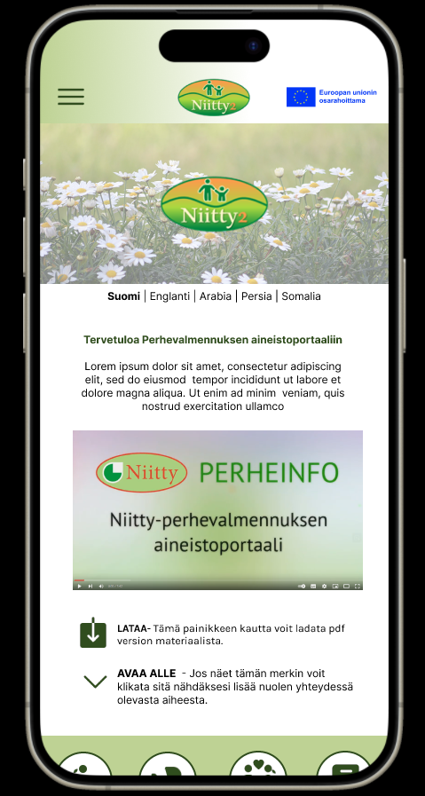
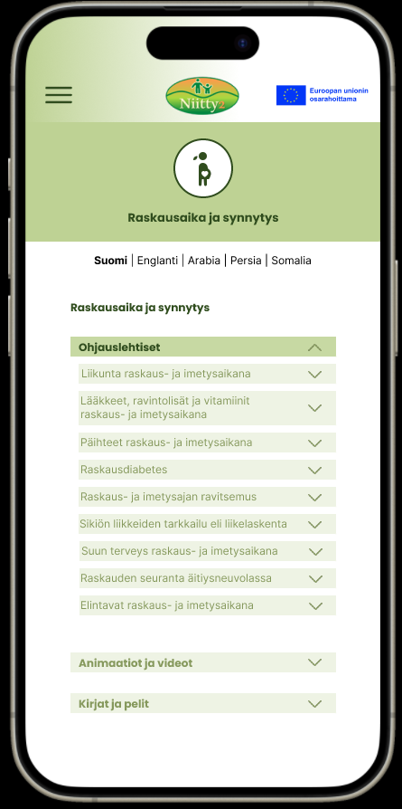

# Portfolio - Neea Merivirta

## Niitty2-hanke projekti

### Asiakkaan kertomus hankkeesta

- Niitty 2 - Yhdessä maahanmuuttajaperheiden hyvän arjen puolesta. Hankkeen päämäärä eli pitkän aikavälin tavoiteltava muutosvaikutus:
  Kolmansien maiden kansalaisten palvelut ovat parantuneet ja palveluissa työskentelevien asiantuntijoiden osaaminen on vahvistunut. Palvelut ovat helposti saatavilla ja maahanmuuttajat käyttävät lisääntyneesti palveluita.

### Projektin tavoite

- Perheinfo-aineistoportaalin kehittäminen
- Avoin portaali, jota käyttävät sekä ammattilaiset, että maahan muuttaneet perheet
- Tehtävänämme oli kehittää Perheinfo- sivuston käytettävyyttä sekä viusaalista ulkonäköä muuttaa paremmaksi.

## Asiakkaan sivut

- https://sites.tuni.fi/perheinfo/

## Linkki Figman prototyyppiin

- https://www.figma.com/design/zM93nncqu1sjrEn311q6m0/Mobiiliproto?node-id=53%3A2&t=tVaiqn5ebK6NIRIO-1

## Näyttökuvia Figmasta

### Author ©Neea Merivirta
