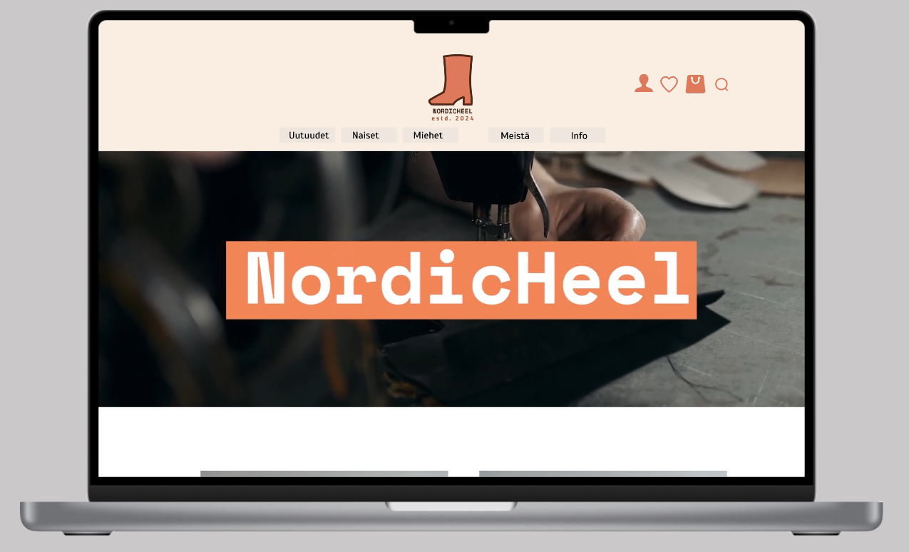
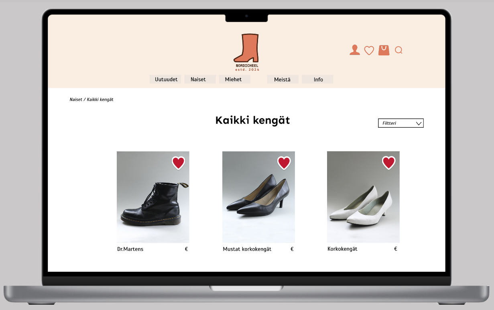

# Portfolio - Neea Merivirta

## NordicHeel-project

- Here you'll find all the necessary materials and information for the NordicHeel project. This project was completed as a group assignment in school. Our task was to design an online store for our own company. Our company's name is NordicHeel, which sells high-quality and durable shoes for women and men.

- The project began with planning what and for whom we were designing. Then, we moved to Mural to create wireframes. From Mural, we quickly transitioned to using Figma. In Figma, we started designing in more detail how the pages might look and what content we might have. We created various prototypes in Figma and also conducted testing. With various feedback and suggestions for improvement, we achieved a functional and, in my opinion, great overall result!

- I have personally designed and edited the banner video for the company. The video can be found among the materials. I also had the honor of shooting material for the website, including the shoe images for the product categories, which are my own creations.

- Within the directory, you'll find our marketing plan, which was also part of this project work. The marketing plan PDF is available in Finnish.

## Link to the NordicHeel-prototype

- https://www.figma.com/proto/LdGGDC80xwuFqVrTREJViA/Figma-prorotyyppi?type=design&node-id=1001-7124&t=6ZHher1HDmnfuIYg-1&scaling=scale-down&page-id=867%3A645&starting-point-node-id=867%3A646&mode=design

## Screenshots

- Screenshots from my first Figma project

### Author ©Neea Merivirta
