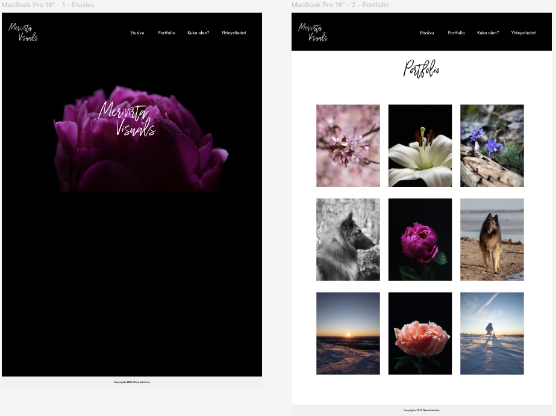

# Portfolio - Neea Merivirta

## Portfolio - Merivirta Visuals

- This is my own project.
- I created a website for myself called Merivirta Visuals. The purpose of the project was to create a simple website where clients could find the necessary information. I occasionally do photography gigs, so I decided to design a visual look for the website using Figma.

## Link to the Portfolio Merivirta Visuals-prototype

- https://www.figma.com/design/Pj6hDOyr6tUa36FJl7AnAQ/Portfolio-web-page?node-id=0-1&t=9tE2QusMOufThGXR-1

## Screenshots

- Screenshots from Figma

### Author ©Neea Merivirta
