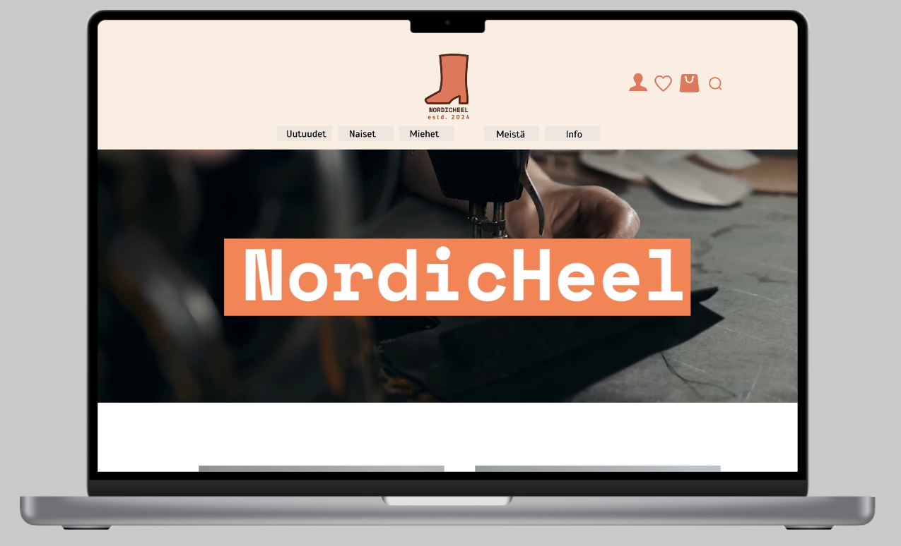

# Portfolio - Neea Merivirta

## Figma projects

- Here you'll find all my Figma projects
- Some are school assignments and some are personal projects made in my free time
- Each project has its own directory where you can find more detailed contents and information about the project

## NordicHeel -project

- Link to the Figma prototype
- https://www.figma.com/proto/LdGGDC80xwuFqVrTREJViA/Figma-prorotyyppi?type=design&node-id=1001-7124&t=6ZHher1HDmnfuIYg-1&scaling=scale-down&page-id=867%3A645&starting-point-node-id=867%3A646&mode=design

## Niitty2 -project

- Niitty2 -project project was implemented at school. The Niitty2 project team hoped to give their website a new visual identity. The purpose of the work was to design a new look for the website and to solve how the material would be made available to the user.
- The project's pages were not user-friendly, and all the material was a bit jumbled on the pages.
- The project was carried out as a pair work. In this project, I designed the mobile version of my pages, and my partner implemented the layout of the website. The project was planned in Figma.

## More projects coming

## Screenshots

- Screenshots from my first Figma project

- Screenshots from the Niitty2- project
  

### Author ©Neea Merivirta
