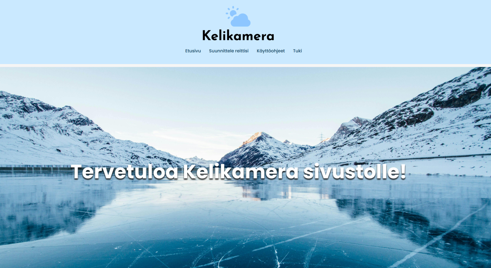

# Kelikamera

## Projektin nimi ja idea

Kyseessä on Kelikamera-projekti, jossa tavoitteena on luoda sovellus, jolla autoilijat voivat suunnitella reittinsä saaden samalla kelikameroiden tietoja reitin varrelta. Käyttäjällä on myös mahdollista saada tietoa jos tiellä esiintyy mustaa jäätä. Projektissa työskentelee kolme ohjelmistotuotannon opiskelijaa.
Asiakkaana on TAMK.

## Käytetty seuraavia ohjelmointi kieliä

 React, CSS, HTML, JavaScript

## Ominaisuudet

Sovelluksessa näkyy esim. Nopein reitti, keskeisimmät kelikamerat ja niiden tiedot, matkan pituus (ajallisesti), kilometrimäärä, reitti visuaalisesti, ja sääolosuhteet. Käyttäjälle näkyy myös mikäli reitin varrella esiintyy mustaa jäätä. 
Sovellus on käytettävyydeltään yksinkertainen, sen sisältö on helposti saavutettavissa ja pyrkii visuaalisesti näyttämään käyttäjälle reitin sekä kelikameroiden oleellisen datan.

## Näyttökuvia sovelluksesta

### Ohjelmistotuotannon projekti- kurssi Kevät 2024.
