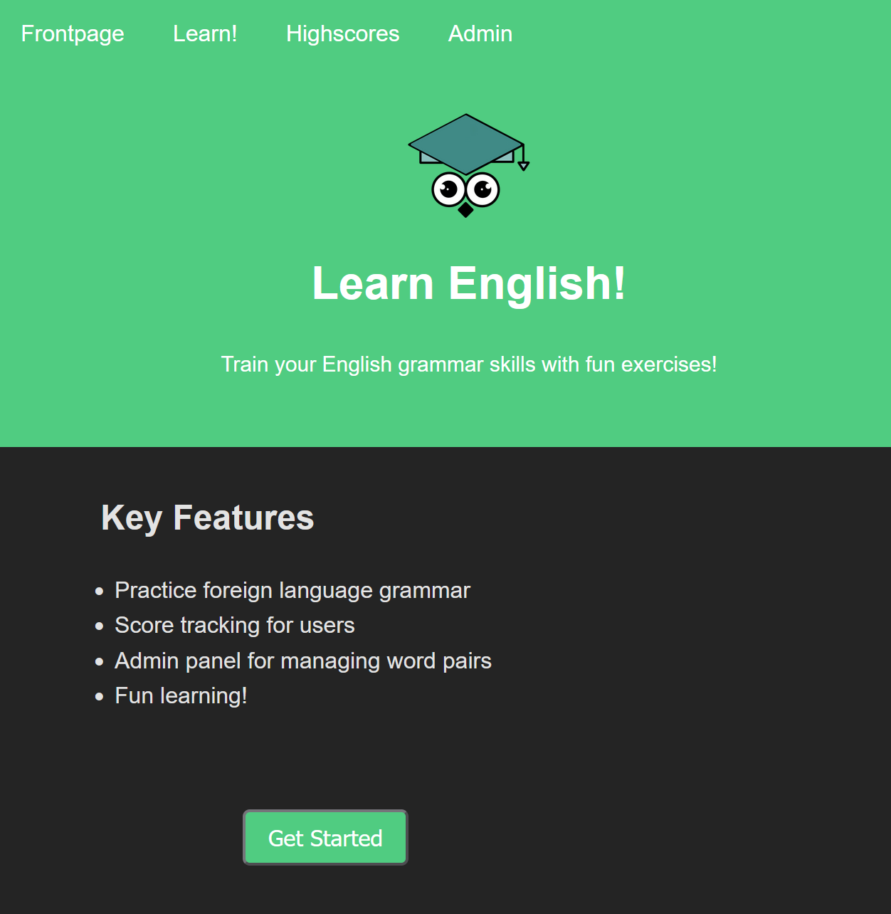

# Learn English! -app

## Project title

This project creates a "Learn English!"- app designed to help children learn English words and their translations. The application has two main user groups: teacher or parent (admin) and child (user).

## Motivation

The project was honestly challenging for myself, because backend coding is not my strongest area of expertise. Frontend coding is easier for me to understand and is also more interesting for me. That's why I started to build this project first through the easiest way, i.e. through the frontend, and little by little I moved to the backend.

The project has otherwise been nice to do and the work was still interesting despite the challenges.

## Built with

- Frontend with React
- Backend with Express/Node.js
- MySQL Database (Tuni)

## Features

- Project stands out due to its innovative approach to language learning. Unlike traditional language learning platforms, we have implemented a personalized learning experience that adapts to the user's progress. Our 'Learn English Words' module not only tests users on vocabulary but also provides real-time feedback, allowing them to understand and correct their mistakes immediately.

- In addition, the backend architecture is designed for scalability and efficiency. A MySQL database and an Express.js server are used to store and retrieve word pairs, which ensures optimal performance even as the user base grows. The use of RESTful API endpoints increases the flexibility of the application.

- In addition, the user interface is designed to be as clear as possible, which promotes the learning experience. I have also taken into account the responsive user experience, where the application is available on different devices.

## Installation and running

- Provide step by step series of examples and explanations about how to get a development env running. Example:

```
# clone repo

git clone repo
cd repo

# npm install

# start

npm run start-frontend & npm run start-backend

# start-frontend

npm run dev --workspace=frontend

# start-backend

npm run dev --workspace=backend
```

## Screenshots

- Screenshots from the app

- First pic is from the frontpage. The user can navigate the page using the links found in the top bar.
  If user wants to play immediately, it's possible with the "Get started" -button.



- Second pic is from the Learn or gaming page whichever name you want to use.
  Here user can learn to translate the english words to finnish.


## Good to know

- The logo that appears on the website was designed by me for this project.


### Author ©Neea Merivirta

### Backend programming- course project work Autumn 2023.
