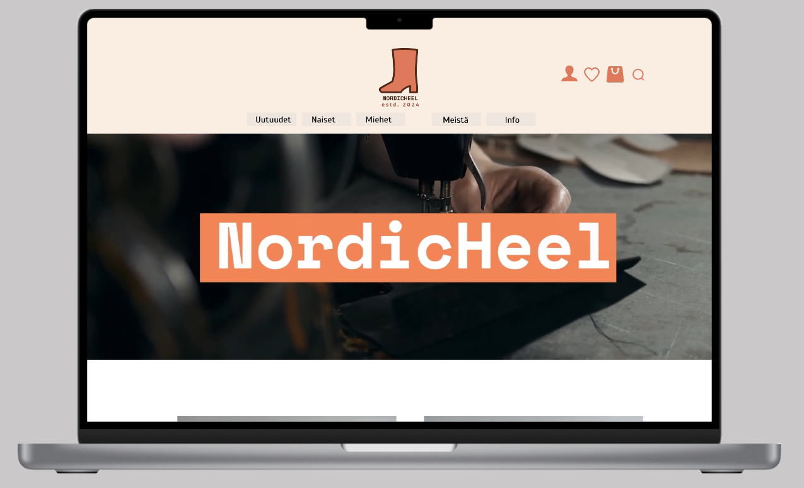

# Portfolio - Neea Merivirta

Welcome to my GitHub repository! Here you'll find a collection of diverse coding projects covering a wide range of topics and technologies. The repository includes projects in different programming languages, web development and much more. Explore the various projects and find inspiration, learn new skills, and discover my expertise!

## Project folders

- Frontend: React, Figma-works, WWW-techniques, CSS, SASS, SCSS...
- Backend: Java, Python, Node.js, JavaScript...
- Fullstack: Node.js, JSON, MySQL, React...

## Screenshots

- Screenshots from my first Figma project

### Author ©Neea Merivirta  neeamerivirta@outlook.com

